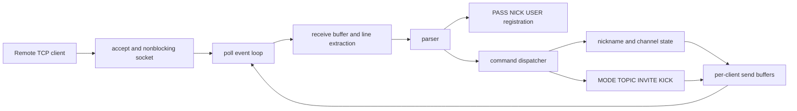

# ft_irc Strict Security and Behavior Audit

Audit date: 2026-07-15  
Target: local working tree at commit `f89e161`  
Remote: `https://github.com/oussama7007/Irc.1337.git`  
Audit scope: all compiled files under `src/` and `include/`, `Makefile`, `README.md`, and the project subject  
Source changes made by this audit: none

## Final verdict

The server is not ready for a strict project evaluation or an untrusted public deployment yet.

The good news is important: I did not reproduce a crash, use-after-free, buffer overflow, remote code execution, or sanitizer failure. The server remained alive during malformed commands, TCP resets, fragmented input, 128 concurrent registered clients, slow readers, and bounded flood tests.

The main problems are state correctness and resource lifetime. The highest-risk issue is that anonymous clients can hold unlimited sockets before authentication. The next group includes nickname and channel casemapping, commands executing after `QUIT`, unlimited channel state, empty channels that never disappear, and persistent topic storage.

### Result summary

| Area | Result |
|---|---:|
| Local protocol and attack assertions | 109 |
| Failed assertions | 30 |
| Confirmed security findings | 13 |
| High severity | 1 |
| Medium severity | 6 |
| Low severity | 6 |
| ASan or UBSan reports | 0 |
| Reproduced crashes | 0 |
| Public IRC load or fuzz tests | 0, intentionally avoided |

Security finding count and protocol failure count are different. Some protocol failures are not security vulnerabilities, while some security findings were proven by dedicated resource tests instead of the 109-command matrix.

## What was tested

The review covered the complete networking path:



Tests included:

- Startup argument and port validation.
- PASS, NICK, USER, CAP, PING, QUIT, unknown commands, and registration order.
- JOIN, PART, PRIVMSG, TOPIC, INVITE, KICK, and MODE `i`, `t`, `k`, `o`, and `l`.
- Every important success numeric and error numeric implemented by the server.
- Multiple clients, duplicate operations, case variants, stale identities, permissions, and state transitions.
- One-byte-at-a-time TCP fragmentation and multiple commands in one TCP write.
- Empty input, malformed commands, missing parameters, NUL, bare CR, very long lines, and receive-buffer overflow.
- 128 registered clients, 256 anonymous idle connections, 2,000 created channels, 12,000 messages to a slow reader, 100 TCP resets, and a 4.27 MB LF-only flood.
- Normal build, ASan, UBSan, and GCC static analyzer.
- Narrow, safe interoperability checks on Libera.Chat for nickname case handling, duplicate JOIN, NICK broadcasts, and INVITE authority. No public server was fuzzed or load-tested.

## Common local test setup

Build and start the server:

```sh
make re
./ircserv 16667 auditpass
```

Open clients in separate terminals:

```sh
nc -C 127.0.0.1 16667
```

Register each client with a unique nickname:

```text
PASS auditpass
NICK Alice
USER alice 0 * :Alice Audit
```

The examples below use `Alice`, `Bob`, `Mallory`, and `Guest`. Replace them with any valid unique nicknames. Empty observed output means the server returned no line during the test timeout.

## Confirmed security findings

### S-01 High: anonymous idle connections can exhaust file descriptors

Source: `src/server/Server.cpp:265-303`

The server accepts a connection and immediately stores its file descriptor, `Client`, and `pollfd`. There is no global connection cap, per-IP cap, registration deadline, or idle timeout. PASS is not required to consume the descriptor.

Test:

```sh
python3 - <<'PY'
import socket, time
sockets = []
for _ in range(256):
    s = socket.create_connection(("127.0.0.1", 16667))
    sockets.append(s)
print("anonymous sockets held:", len(sockets))
time.sleep(30)
PY
```

While the test is sleeping:

```sh
pid=$(pgrep -n ircserv)
ls "/proc/$pid/fd" | wc -l
```

Observed:

```text
Baseline descriptors: 4
Anonymous sockets opened: 256
Descriptors while held: 260
Descriptors after close: 4
```

Expected: the server should bound anonymous resource use using connection limits and a short registration timeout. A legitimate connection should still be accepted when the anonymous limit is reached.

Impact: a remote client needs no password. Enough held sockets eventually reach the process file-descriptor limit, after which `accept()` fails and legitimate users cannot connect.

Fix direction: add a global cap, a per-address cap, a registration deadline, an idle timeout, and explicit `EMFILE` or `ENFILE` handling.

### S-02 Medium: nickname uniqueness does not use IRC casemapping

Source: `src/server/Server.cpp:553-565`

Test:

Client A:

```text
PASS auditpass
NICK CaseNick
USER casea 0 * :Case A
```

Client B:

```text
PASS auditpass
NICK casenick
USER caseb 0 * :Case B
```

Observed:

```text
:server 001 casenick :Welcome to the ft_irc Network, casenick!caseb@localhost
```

Expected:

```text
:server 433 * casenick :Nickname is already in use
```

Libera.Chat returned 433 for the same case-variant test. IRC nickname comparison is not normal byte-exact comparison. RFC1459 casemapping also treats some bracket characters as equivalent.

Impact: two clients can occupy one logical IRC identity. This causes impersonation and target ambiguity even though C++ pointer-based channel operator state does not automatically transfer.

Fix direction: create one canonical IRC casemapping function and use it for every nickname insert, lookup, comparison, PRIVMSG target, INVITE target, KICK target, and MODE `+o` target. Preserve the original spelling only for display.

### S-03 Medium: channel lookup does not use IRC casemapping

Source: `src/server/Server.cpp:569-588`

Test:

```text
# Alice
JOIN #CaseRoom

# Bob
JOIN #caseroom
PRIVMSG #caseroom :hello
```

Observed: the users enter two separate channel objects. Alice does not receive Bob's message, and both users can become operator of their separate object.

Expected: `#CaseRoom` and `#caseroom` resolve to one IRC channel identity.

Impact: an ordinary user can create a shadow channel with separate operator, key, topic, mode, invite, and membership state. IRC clients and users may display the names as the same identity.

Fix direction: canonicalize the map key before every channel lookup and creation. Keep the first display spelling separately.

### S-04 Medium: one client can retain unlimited live channel memberships

Source: `src/commands/Join.cpp:48-83` and `src/server/Server.cpp:579-588`

Test shape:

```text
PASS auditpass
NICK Grower
USER grower 0 * :Grower
JOIN #live0000
JOIN #live0001
JOIN #live0002
... repeat unique names ...
```

Observed: each unique name allocates a global `Channel`, and the same client stays in every channel as member and operator. There is no per-client channel limit or global channel count limit.

A bounded real-interface run reached 2,000 channel allocations and the server stayed alive. The test did not intentionally continue until heap exhaustion.

Expected: a practical server-wide limit and a per-client membership limit should stop cumulative growth with a clear numeric reply.

Impact: one password-bearing ordinary client can grow shared memory and map work until availability degrades.

Fix direction: enforce both a per-client joined-channel quota and a global live-channel quota.

### S-05 Medium: empty channels and their modes never disappear

Source: `src/commands/PartCommand.cpp:39-45` and `src/server/Server.cpp:492-521`

Focused lockout test:

```text
# Alice
JOIN #locked
MODE #locked +i
PART #locked :leaving

# Bob
JOIN #locked
```

Observed for Bob:

```text
:server 473 Bob #locked :Cannot join channel (+i) - you must be invited
```

There is no remaining member or operator who can invite Bob.

Resource test result:

```text
Channels created and parted: 2000
RSS before: 3872 KiB
RSS after: 4436 KiB
RSS after attacker disconnect: 4436 KiB
Retained growth: 564 KiB
```

A later user joined an old non-restricted channel but did not become operator:

```text
:server 482 leaknext #leak0000 :You're not channel operator
```

Expected: when the final member leaves a normal channel, the channel should be destroyed. A later JOIN should create a fresh channel and make that first member operator.

Impact: memory and attacker-chosen state persist until server restart. Restrictive channels can become permanently unusable.

Fix direction: erase and delete a channel when its last member leaves, after safely clearing invitations and references.

### S-06 Medium: large topics amplify permanent channel memory

Source: `src/commands/TopicCommand.cpp:56-63`

Test:

```text
JOIN #persist
TOPIC #persist :attacker-controlled-topic
PART #persist
```

Then reconnect another client:

```text
JOIN #persist
```

Observed: numeric 332 returns the old stored topic even after the original setter disconnected.

The receive buffer allows a single topic close to 8 KiB, and unique channels allow the client to repeat the storage operation indefinitely.

Expected: topic length should have a protocol-appropriate bound, and an empty nonpersistent channel should be destroyed with its topic.

Impact: topics add attacker-controlled bytes to the already unbounded process-lifetime channel map.

Fix direction: limit topic size, reclaim empty channels, and add cumulative state quotas.

### S-07 Medium: commands after QUIT execute from the same TCP batch

Source: `src/server/Server.cpp:360-368` and `src/server/Server.cpp:430-435`

Exact test:

```sh
printf 'PASS auditpass\r\nNICK actor\r\nUSER actor 0 * :Actor\r\nQUIT :bye\r\nJOIN #afterquit\r\n' | nc 127.0.0.1 16667
```

Observed by another client:

```text
:actor!actor@localhost JOIN :#afterquit
:actor!actor@localhost QUIT :Quit: bye
```

A second test batched `QUIT` followed by `MODE #state +i`. The mode was applied and a later outsider received 473, proving persistent state mutation after the terminal command.

Expected: once QUIT marks the client closing, no later line from that client may execute.

Root cause: the line loop breaks only when `isDead()` becomes true. QUIT sets `isClosing()` instead.

Fix direction: after every command, stop the loop if the client is closing or dead, then discard the remaining receive buffer.

### S-08 Low: missing NICK broadcast enables stale-name message interception

Source: `src/commands/Nick.cpp:63-74`

Three-client test:

```text
# Alice and Bob first join #shared

# Alice
NICK NewAlice

# Mallory, immediately after Alice changes
NICK Alice

# Bob, who received no NICK event
PRIVMSG Alice :secret-for-old-alice
```

Observed:

```text
Bob after Alice's NICK: no output
Mallory registration: :server 001 Alice ...
Mallory received: :Bob!Bob@localhost PRIVMSG Alice :secret-for-old-alice
NewAlice received: no message
```

Expected: Bob and all other affected peers receive `:Alice!... NICK :NewAlice` exactly once before the old nickname becomes available.

Impact: the attack requires timing and a peer acting on stale state, but the cross-client private-message interception was reproduced.

Fix direction: collect all peers who share a channel with the changer, deduplicate them, and broadcast the NICK transition to those peers and the changer.

### S-09 Low: unlimited online PASS guessing

Source: `src/commands/Pass.cpp:9-20`

Test:

```text
PASS wrong01
PASS wrong02
PASS wrong03
... 20 wrong values ...
PASS auditpass
NICK GuessOk
USER guess 0 * :Guess Test
```

Observed:

```text
464 replies: 20
Connection closed or delayed: no
Correct later PASS accepted: yes
Registration 001 received: yes
```

Expected for a hardened server: bound attempts using disconnect, backoff, and per-address rate limits.

Impact: practical password recovery still depends on password strength. A correct guess grants normal registration, not host or channel-operator authority. That is why this is Low instead of High.

Fix direction: require a strong password and limit failures per socket and address.

### S-10 Low: NUL and bare CR are forwarded to other clients

Source: `src/client/Client.cpp:138-151`, `src/parser/Parser.cpp:21-60`, and `src/commands/PrivmsgCommand.cpp:22-53`

Raw-byte test:

```python
sender.sendall(b"PRIVMSG #ctl :before\x00after\r\n")
print(repr(receiver.recv(4096)))
```

Observed:

```text
b':CtlSender!CtlSender@localhost PRIVMSG #ctl :before\x00after\r\n'
```

Bare CR and NUL were also preserved inside server-generated fields.

Expected: an IRC message containing NUL, embedded LF, or bare CR must be rejected before parsing, storage, or forwarding.

Impact: downstream clients can truncate, misrender, or incorrectly parse a server-generated message. No C++ memory corruption was observed because `std::string` and length-aware `send()` preserve the bytes safely.

Fix direction: validate the complete raw IRC frame before parsing and state mutation.

### S-11 Low: input and output lines exceed the 512-byte IRC limit

Source: `src/client/Client.cpp:124-152`

Input test:

```python
s.sendall(b"PING :" + b"x" * 600 + b"\r\n")
```

Observed: the server returned a PONG containing the complete 600-byte token instead of rejecting the line.

Cross-client test: a 1,000-byte PRIVMSG body became a 1,041-byte line at the recipient.

Server-generated output test:

```text
Clients joined to one channel: 80
353 NAMES line length including CRLF: 752 bytes
IRC limit: 512 bytes
```

Expected: every inbound and outbound IRC message is at most 512 bytes including CRLF. Long NAMES replies must be split across multiple 353 lines.

Impact: bounded amplification and interoperability failure. The existing 8 KiB receive cap and 64 KiB send-buffer cap prevented unbounded one-message growth and kept the server healthy.

Fix direction: enforce the limit per extracted input line and introduce a centralized bounded message builder for every output.

### S-12 Low: TOPIC stores and replays forbidden control bytes

Source: `src/commands/TopicCommand.cpp:56-63` and `src/commands/Join.cpp:93-94`

Raw test value:

```text
alpha\r:server NOTICE observer :stored-spoof\x00tail
```

Observed: current members received the raw bytes in the TOPIC event. After the setter disconnected, a future member received the same bytes inside numeric 332.

Expected: forbidden bytes are rejected before the topic is stored. Stored application fields must always be safe to place in an IRC line.

Impact: unlike S-10's immediate relay, this payload persists and reaches future users. Exact display impact still depends on the IRC client.

Fix direction: reject forbidden bytes centrally and validate topic length before storage.

### S-13 Low: a non-operator invitation survives a later `+i` transition

Source: `src/commands/InviteCommand.cpp:34-54`

Test:

```text
# Alice creates an open channel
JOIN #inviteflow

# Bob joins but is not operator
JOIN #inviteflow
INVITE Guest #inviteflow

# Alice later makes the channel invite-only
MODE #inviteflow +i

# Guest
JOIN #inviteflow
```

Observed: Bob received 341 for the INVITE, and Guest successfully joined after `+i` was enabled.

Expected for this project: INVITE is an operator command. Bob should receive 482. Libera.Chat also returned 482 for the exact non-operator invitation and later returned 473 to the guest.

Impact: the old non-operator decision crosses a later operator-controlled admission boundary. It requires timing and grants only membership, not operator status.

Fix direction: make INVITE operator-only as required by the subject, or store invitation provenance and invalidate non-operator invitations when `+i` is enabled.

## All 30 failed command assertions

This table is the compact complete failure matrix. Security-relevant rows are explained in detail above. The remaining rows are mandatory behavior or interoperability defects.

| # | Test command or state | Observed result | Correct result |
|---:|---|---|---|
| 1 | `PASS auditpass` after registration | No reply | 462 `ERR_ALREADYREGISTRED` |
| 2 | PING with a 600-byte token | Full PONG accepted | Reject or disconnect the oversized line |
| 3 | Register `casenick` while `CaseNick` exists | Second 001 welcome | 433 nickname in use |
| 4 | User changes NICK in a shared channel | Peer receives nothing | Peer receives NICK transition |
| 5 | `JOIN #duptest` twice | JOIN, 331, 353, and 366 repeated to self; JOIN repeated to peer | No output and no state change |
| 6 | Join `#CaseRoom` and `#caseroom` | Two separate channels | One casemapped channel |
| 7 | Last member PARTs, then a new user joins | New user is not operator and gets 482 | Fresh channel and new first user is operator |
| 8 | `PRIVMSG Bob :` | Empty message delivered | 412 `ERR_NOTEXTTOSEND` |
| 9 | `MODE #room` | `324 ... +...` placeholder | 324 with the real active modes and required parameters |
| 10 | `MODE #room +k` | No reply | 461 or an explicit missing-parameter error, no state change |
| 11 | `MODE #room +l abc` | No reply | Explicit invalid parameter error, no state change |
| 12 | `MODE #room +l 1abc` | Accepted and broadcast | Reject because the whole value is not numeric |
| 13 | `MODE #room +l 2` | Broadcast contains `++l 2` | Broadcast contains `+l 2` |
| 14 | `QUIT` and `JOIN` in one write | JOIN executes before cleanup | Only QUIT executes |
| 15 | CAP LS, PASS, NICK, USER without CAP END | 001 sent immediately | If CAP is implemented, registration waits for CAP END |
| 16 | `USER bad@name 0 * :Bad` | Welcome prefix becomes `bad@name@localhost` | Reject or validate username so server prefixes remain valid |
| 17 | 20 wrong PASS commands | 20 replies, no throttle or close | Hardened server bounds online guesses |
| 18 | `JOIN #one,#two` | 476 on the combined string | Join both IRC channel targets |
| 19 | `MODE #room +o` without nickname | No reply | 461 or explicit missing-parameter error |
| 20 | `QUIT :bye` | Peer sees `QUIT :Quit: bye` | Peer should receive the supplied reason once, normally `QUIT :bye` |
| 21 | `PRIVMSG multib :x` while target is `MultiB` | 401 no such nick | Deliver through IRC casemapped lookup |
| 22 | `PRIVMSG Bob,Carol :x` | 401 for combined target | Deliver once to each valid target |
| 23 | Operator KICKs a member | Target receives KICK, operator receives nothing | Every affected member, including issuer, receives one KICK event |
| 24 | `MODE #mix +il abc` | `+i` silently applies, no broadcast, then outsider gets 473 | Reject atomically, or report and broadcast every applied change |
| 25 | `JOIN #bad:name` | Channel is accepted and created | 476 invalid channel name |
| 26 | `MODE #room +l 4294967297` | Accepted, broadcast as `++l`, effective limit wraps to 1 | Reject out-of-range value before conversion |
| 27 | `MODE #room i` without `+` or `-` | Invite-only silently becomes active | Reject malformed mode string |
| 28 | `PART #one,#two :bye` | 403 on combined string | Leave both listed channels |
| 29 | PRIVMSG containing NUL | NUL reaches another client | Reject malformed frame |
| 30 | Rename, attacker claims old nick, peer sends old nick | Attacker receives private message | Peers receive rename and do not keep stale server state |

## MODE is the least reliable command right now

Most MODE problems come from `src/commands/ModeCommand.cpp:44-128`:

- `isPlus` starts as true, so a mode string without `+` is accepted as addition.
- Sign characters are appended immediately, then the `l` branch appends `+l` again. This creates `++l`.
- `std::atoi()` accepts a numeric prefix, so `1abc` becomes 1.
- `std::atoi()` cannot report overflow. `4294967297` became an effective limit of 1 in the test.
- Missing `k` and `o` parameters can end silently.
- In `+il abc`, `i` mutates the channel first. Invalid `l` then suppresses the broadcast but does not roll back `i`.
- MODE query returns a placeholder instead of actual state.

The safest design is parse first, validate every mode and parameter without mutating state, then apply the validated operations and generate one correct broadcast. Do not use `atoi()` here. Use strict stream parsing or a checked decimal parser with full-string and range validation.

## Static reliability weakness: temporary nonblocking errors are treated as disconnects

Source: `src/server/Server.cpp:345-348` and `src/server/Server.cpp:391-394`

Current behavior:

```cpp
if (bytesRead < 0)
    client->markDead("recv() failed");

if (bytesSent <= 0)
    client->markDead("send() failed");
```

On a nonblocking socket, `recv()` and `send()` can return `-1` with `errno == EAGAIN` or `EWOULDBLOCK`. An interrupted syscall can return `EINTR`. These are retry conditions, not dead connections.

I did not force a deterministic false disconnect during the bounded tests, so this is a static reliability weakness, not a dynamically confirmed security finding.

Correct behavior:

- On `EAGAIN` or `EWOULDBLOCK`, keep the client and wait for the next poll readiness event.
- On `EINTR`, retry safely or return to the event loop.
- Mark the client dead only for real terminal socket errors.

## Resource and latency results

| Test | Result |
|---|---|
| Baseline PING | median 0.021 ms, p95 0.023 ms, max 0.167 ms |
| 128 concurrent registrations | 128 registered, 128 PONG replies |
| Registration latency at 128 clients | median 1.156 ms, p95 7.787 ms, max 9.148 ms |
| 256 anonymous idle sockets | all opened, descriptors grew from 4 to 260 |
| 2,000 created and parted channels | 564 KiB RSS remained after disconnect |
| 12,000 messages with one slow reader | slow reader isolated, sender continued, server PING passed |
| 100 TCP RST disconnects | server remained alive and accepted a new client |
| 4,272,128 LF flood bytes | 200 of 200 PINGs succeeded, p95 1.039 ms |
| 80 users in one channel | generated 353 line was 752 bytes, over the 512-byte IRC limit |

The LF-only flood did not create a practical starvation failure in this test. Its repeated front erases may still be inefficient, but the measured result is a pass, not a vulnerability.

## Things that passed

- Project builds successfully with the normal flags.
- No ASan or UBSan report occurred in the full black-box and command-branch suites.
- GCC `-fanalyzer` produced no diagnostic.
- Byte-fragmented PASS, NICK, and USER registration works.
- A 9,000-byte no-newline buffer disconnects only the attacker, and the server remains healthy.
- Client-supplied IRC prefixes are ignored. The server creates the real sender prefix.
- Wrong channel key returns 475; correct key works.
- Invite-only returns 473 to a non-invited user.
- Channel limit returns 471 when full.
- Non-member PART returns 442.
- Non-operator KICK and MODE return 482.
- Missing channels and users return the expected 401, 403, 441, and related numerics in tested branches.
- Valid `+i`, `-i`, `+t`, `-t`, `+k`, `-k`, `+o`, and `-o` basic operations work when parameters are valid.
- A kicked user loses membership and cannot send to the channel.
- The 64 KiB per-client output-buffer control isolates a slow reader instead of freezing the whole server.
- Descriptor cleanup works when clients actually close.

Valgrind was not installed, so there is no Valgrind leak report. Sanitizers and bounded lifetime tests were used instead.

## Startup validation results

| Command | Result |
|---|---|
| `./ircserv` | Usage error, exit 1 |
| `./ircserv 0 pass` | Rejected |
| `./ircserv 65536 pass` | Rejected |
| `./ircserv +6667 pass` | Rejected |
| Port containing spaces | Rejected |
| Extremely large decimal port | Rejected without integer overflow |
| Empty password | Rejected |
| Valid port and password | Server starts and SIGTERM cleanup works |

The strict port parser is correct for the project's chosen contract. Port 0 can be valid at the kernel API level because `bind()` assigns an ephemeral port, but rejecting it is reasonable because users must know which IRC port to connect to.

## Project evaluation blockers

### README does not match the subject requirements

The current `README.md` starts with `# IRC` and contains working notes in Darija. The subject requires the first line to identify the 42 curriculum and authors in italics, followed by clear English sections for Description, Instructions, and Resources, including how AI was used.

Before evaluation, rewrite it as project documentation, not study notes. Keep debugging notes in a separate ignored file.

### No declared reference IRC client

The subject expects a reference client to be chosen and used during evaluation. This audit used raw TCP clients for complete control of bytes because no reference client was documented or installed in the repository.

Choose one client, document its name and version, then rerun registration, JOIN, messaging, KICK, INVITE, TOPIC, and every MODE transition with that client.

### Source presentation is not clean yet

The compiled source contains many `//oadouz` markers and `src/commands/Pass.cpp` starts with a `PARTNER'S PART` placeholder. These are not runtime vulnerabilities, but they look unfinished and will make a defense harder. Remove ownership markers and placeholders only after the functional fixes are stable.

## Production hardening outside the strict ft_irc subject

These points are not reasons to fail the school project by themselves, but they matter if the server is exposed beyond a controlled lab:

- The listener binds to `INADDR_ANY`, so it is reachable on every IPv4 interface allowed by the host firewall.
- Client traffic and PASS are plaintext. There is no TLS.
- One shared password authenticates every ordinary user. There are no accounts or per-user credentials.
- There is no logging policy, abuse monitoring, IP throttling, or ban system.
- Connection, channel, topic, and per-user quotas are incomplete.

## Recommended fix order

1. Stop command execution immediately after QUIT or any closing transition.
2. Add anonymous connection limits and registration timeouts.
3. Fix empty-channel destruction and operator lifecycle.
4. Implement one IRC casemapping function for every nickname and channel operation.
5. Rewrite MODE as validate first, apply second, broadcast third.
6. Enforce raw-frame control-byte rules and the 512-byte line limit on both input and output.
7. Broadcast NICK changes correctly and deduplicate recipients.
8. Fix duplicate JOIN, KICK issuer synchronization, empty PRIVMSG, PASS-after-registration, username validation, and QUIT formatting.
9. Decide which RFC list features and CAP negotiation behavior the chosen reference client requires.
10. Add resource quotas and PASS throttling.
11. Rewrite README and clean temporary ownership comments.
12. Rerun the full matrix under normal build, ASan/UBSan, and the declared reference IRC client.

## Standards and comparison references

- Project subject: local `irc.pdf` in this repository.
- IRC message format, casemapping, commands, numerics, and 512-byte message limit: [RFC 2812](https://www.rfc-editor.org/rfc/rfc2812.html).
- Safe public comparison target and connection guidance: [Libera.Chat connection guide](https://libera.chat/guides/connect).

The project should follow its subject and declared reference client first. A large public IRC network is useful as a comparison, but its extensions are not automatically mandatory for this school implementation.
